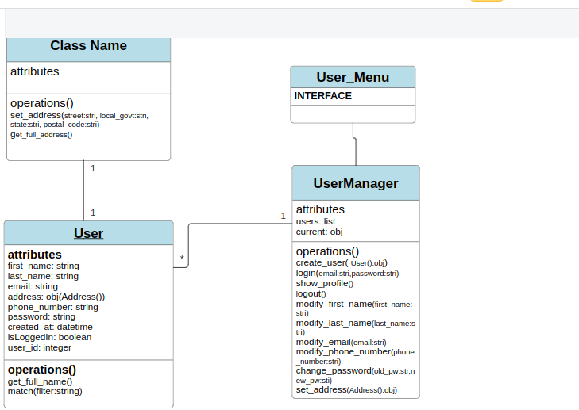

# E-Commerce

## Overview

This project an e-commerce platform with several system to handle various aspect of the project. It's my humble attempts to learn and practice OOP in python.For now i have implemented the user management system. In the future i plan to add other systems. I will constantly update the README file as more features and system is added. The user management system, interact with the user using the terminal as the interface(I decided to use the terminal instead of the web, to remove the complexity and abstraction that comes with it, so i can just focus on OOP design and implementation). It allows users to create accounts, log in, edit their profiles, and delete accounts. The application stores user data in a JSON file to ensure data persistence across sessions(not yet implemented).

## Project UML diagram




## Features

- **User Registration:** Allows new users to create an account.
- **User Login:** Existing users can log in with their email and password.
- **Profile Viewing:** Logged-in users can view their profile information.
- **Profile Editing:** Users can update their email, first name, last name, password, address, and phone number.
- **Account Deletion:** Users can delete their accounts(not implemented yet).
- **Data Persistence:** User data is stored in a JSON file to maintain persistence across sessions(not implemented yet).

## Installation

### Prerequisites

- Python 3.7 or higher

### Steps

1. **Clone the Repository**

    ```sh
     git clone https://github.com/Franklyn883/E-commerce.git
    ```

## Usage

### Running the Application

1. Navigate to the project directory.
2. Run the `user_menu.py` script:

    ```sh
    python user_menu.py
    ```

### Menu Options

- **Create an Account:** Follow the prompts to enter your first name, last name, email, and password.
- **Login:** Enter your email and password to log in.
- **Show Profile:** View your profile information.
- **Edit Profile:** Update your profile details.
- **Logout:** Log out of your account.
- **Quit:** Exit the application.

### Profile Editing Options

- **Change Email:** Update your email address.
- **Edit First Name:** Update your first name.
- **Edit Last Name:** Update your last name.
- **Change Password:** Change your password by providing the old and new passwords.
- **Set/Change Address:** Update your address details (street, local government, state, postal code).
- **Set/Change Phone Number:** Update your phone number.
- **Delete Account:** Delete your account permanently.
- **Back to Profile Menu:** Return to the profile menu.

## Usage

### Running the Application

1. Navigate to the project directory.
2. Run the `user_menu.py` script:

    ```sh
    python user_menu.py
    ```

### Menu Options

- **Create an Account:** Follow the prompts to enter your first name, last name, email, and password.
- **Login:** Enter your email and password to log in.
- **Show Profile:** View your profile information.
- **Edit Profile:** Update your profile details.
- **Logout:** Log out of your account.
- **Quit:** Exit the application.

### Profile Editing Options

- **Change Email:** Update your email address.
- **Edit First Name:** Update your first name.
- **Edit Last Name:** Update your last name.
- **Change Password:** Change your password by providing the old and new passwords.
- **Set/Change Address:** Update your address details (street, local government, state, postal code).
- **Set/Change Phone Number:** Update your phone number.
- **Delete Account:** Delete your account permanently.
- **Back to Profile Menu:** Return to the profile menu.


